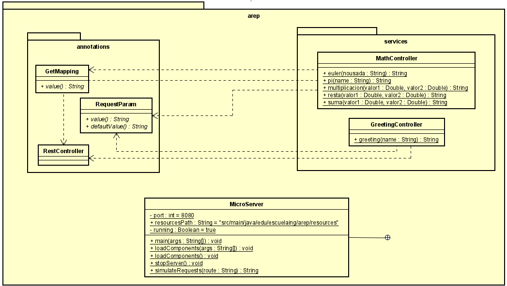
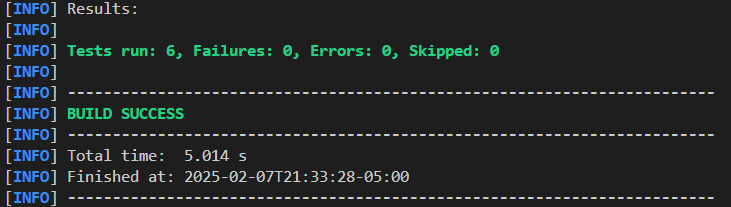

# Distributed Applications

This project is a simple HTTP server implementation in Java that processes GET and POST requests without using frameworks like Spring Boot. The server is designed to handle basic RESTful endpoints and serve static files, such as HTML, CSS, and JavaScript, from a designated directory.


## Getting Started

These instructions will get you a copy of the project up and running on your local machine for development and testing purposes.

### Prerequisites

You need to install the following tools to run the project:
1. Java
    ```
    java -version
    ```
    It should appear something like this:
    ```
    java version "17.0.10" 2024-01-16 LTS
    Java(TM) SE Runtime Environment (build 17.0.10+11-LTS-240)
    Java HotSpot(TM) 64-Bit Server VM (build 17.0.10+11-LTS-240, mixed mode, sharing)
    ```
2. Maven
    ```
    mvn -version
    ```
    It should appear something like this:
    ```
    Apache Maven 3.9.6 (bc0240f3c744dd6b6ec2920b3cd08dcc295161ae)
    Maven home: C:\workspace\apache-maven-3.9.6-bin\apache-maven-3.9.6
    Java version: 17.0.10, vendor: Oracle Corporation, runtime: C:\Program Files\Java\jdk-17
    Default locale: es_CO, platform encoding: Cp1252
    OS name: "windows 11", version: "10.0", arch: "amd64", family: "windows"
    ```
3. Git
    ```
    git --version
    ```
    It should appear something like this:
    ```
    git version 2.44.0
    ```

### Installing

1. Clone this repository and go to project directory:
    ```
    git clone https://github.com/oscar0617/Lab01-AREP-AplicacionesDistribuidas

    cd Lab01-AREP-AplicacionesDistribuidas
    ```
2. Build the project:
    ```
    mvn package
    ```
    Should appear something like this:
    ```
    [INFO] Building jar: C:\Users\luzma\Desktop\AREP\Lab01-AREP-AplicacionesDistribuidas\target\Lab01-AREP-AplicacionesDistribuidas-1.0-SNAPSHOT.jar
    [INFO] ------------------------------------------------------------------------
    [INFO] BUILD SUCCESS
    [INFO] ------------------------------------------------------------------------
    ```
3. Run the project:
    ```
    java -cp target/Lab01-AREP-AplicacionesDistribuidas-1.0-SNAPSHOT.jar edu.escuelaing.arep.HttpServer
    ```
    Should appear something like this:
    ```
    Listo para recibir ...
    ```
Now you are able to access into the ```index.html```.

## Architecture


#### Overview

This architecture diagram provides an overview of the interactions between the **user**, **browser**, and the **server** in the lightweight HTTP server implementation. It highlights the key components and their relationships to demonstrate how HTTP requests are processed and responses are delivered.


#### **User**
- Represents the end user who interacts with the system by sending HTTP requests via a web browser.
- Example: Typing a URL or clicking a button in the web application.

#### **Browser**
- The browser acts as the client that sends HTTP requests to the server and processes the responses.

##### Components:
1. **HTML**:
   - Provides the structure of the webpage, including forms for GET and POST requests.
   - Example: A form where the user can enter a name to send a request to the server.
   
2. **CSS**:
   - Styles the HTML content to make the webpage visually appealing.
   
3. **JavaScript**:
   - Sends asynchronous HTTP requests (via `XMLHttpRequest` or `fetch`) to the server.
   - Processes responses to dynamically update the webpage without requiring a full page reload.

#### **Server**
The server receives and processes HTTP requests from the browser, running on **port 35000**.

##### Components:
1. **HttpServer**:
   - The main component of the server.
   - Listens for HTTP requests on port 35000.
   - Routes requests to the appropriate handler (static file handler or REST service).

2. **HelloRestService**:
   - A RESTful service that processes dynamic requests to the `/app/hello` endpoint.
   - Takes parameters from the query string (e.g., `?name=John`) and returns a JSON response.
   - Example Response: `{ "name": "John" }`.

##### Key Interactions:
1. **Static Requests**:
   - Requests for static files like HTML, CSS, and JavaScript are served by the `HttpServer` by locating the files in the `static` directory.
   - The browser uses these files to render the webpage.

2. **Dynamic Requests**:
   - When the user interacts with the form (e.g., submitting a name), the browser sends an HTTP GET or POST request to the `/app/hello` endpoint.
   - The `HelloRestService` processes the request and returns a dynamic JSON response.

## Class Diagram


#### Overview
The diagram represents the structure and methods of the `HttpServer` class, which serves as the core component of the HTTP server implementation in this project. Here’s a detailed breakdown of its elements:

#### **Class: `HttpServer`**
This class is responsible for managing the entire lifecycle of the HTTP server, including receiving requests, processing them, and sending responses back to clients.

#### **Methods**:
1. **`+ startServer(port: int): void`**
   - **Description**: This method initializes the server on the specified port and starts listening for incoming connections.
   - **Purpose**: It is the entry point for the server, setting up the `ServerSocket` and managing the main request-handling loop.

2. **`+ helloRestService(path: String, query: String): String`**
   - **Description**: Processes requests to the `/app/hello` RESTful endpoint. It generates a JSON response using the query parameter passed in the request.
   - **Purpose**: Implements the server's REST functionality by dynamically constructing and returning a personalized message.

3. **`+ serveFile(out: PrintWriter, filePath: String): void`**
   - **Description**: Reads a file from the server's file system and sends it to the client. It also determines whether the file exists and handles errors (e.g., returning a 404 error for missing files).
   - **Purpose**: Facilitates static file serving, enabling the server to deliver resources such as HTML, CSS, and JavaScript.

4. **`+ getContentType(filePath: String): String`**
   - **Description**: Determines the MIME type of a file based on its extension (e.g., `.html`, `.css`, `.js`, etc.).
   - **Purpose**: Ensures the server sends the correct `Content-Type` header in HTTP responses, which is essential for browsers to interpret files properly.


## Running the tests

The following unit tests were created to validate the functionality of the `HttpServer` class. These tests ensure that each component of the server behaves as expected.

#### **1. `testHelloRestService`**
- **Purpose**: Validates that the `helloRestService` method correctly generates a JSON response for the `/app/hello` endpoint.
- **What it tests**:
  - When the query parameter `name=John` is provided, the method returns a properly formatted HTTP response with a JSON payload: `{"name": "John"}`.

#### **2. `testGetContentTypeHtml`**
- **Purpose**: Ensures that the `getContentType` method returns the correct MIME type for `.html` files.
- **What it tests**:
  - Verifies that `getContentType("index.html")` returns `"text/html"`.

#### **3. `testGetContentTypeCss`**
- **Purpose**: Validates that the `getContentType` method recognizes `.css` files and returns the correct MIME type.
- **What it tests**:
  - Checks if `getContentType("styles.css")` returns `"text/css"`.

#### **4. `testGetContentTypeJs`**
- **Purpose**: Ensures that the `getContentType` method correctly identifies `.js` files and returns the MIME type for JavaScript.
- **What it tests**:
  - Confirms that `getContentType("script.js")` returns `"application/javascript"`.

#### **5. `testGetContentTypeUnknown`**
- **Purpose**: Verifies that the `getContentType` method falls back to `"text/plain"` for unknown file extensions.
- **What it tests**:
  - Ensures that `getContentType("file.unknown")` returns `"text/plain"`.

#### **6. `testServeFileNotFound`**
- **Purpose**: Simulates serving a non-existent file and validates the server's error-handling functionality.
- **What it tests**:
  - Ensures that when a file does not exist, the server returns a `404 Not Found` response with an appropriate error message.
  - Example Response:
    ```
    HTTP/1.1 404 Not Found
    <h1>404 File Not Found</h1>
    ```



## Conclusion

This project demonstrates the foundational concepts of building a lightweight HTTP server in Java, emphasizing low-level control over HTTP request handling without relying on frameworks like Spring Boot. Through the implementation of the `HttpServer`, we explored the following key aspects:

1. **Static and Dynamic Content Handling**: The server successfully serves static files (HTML, CSS, JavaScript) from a designated directory and processes dynamic RESTful requests to generate JSON responses.
2. **Custom HTTP Routing**: The `HttpServer` employs a routing mechanism to direct requests to appropriate handlers, showcasing a clear separation of responsibilities between static file serving and REST API logic.
3. **Error Handling**: The project includes basic error handling, such as returning a `404 Not Found` response for invalid file paths, ensuring reliability and better user experience.
4. **Test-Driven Development**: The project employs unit tests to validate key functionalities like content type detection, REST API response generation, and file handling, ensuring correctness and robustness.

This implementation serves as an excellent introduction to understanding the inner workings of HTTP servers, making it a valuable educational tool. While the project is simple in scope, it provides a strong foundation for expanding into more complex server architectures or integrating additional features, such as database connectivity or middleware layers.


## Built With

* [Maven](https://maven.apache.org/) - Dependency Management
* [GIT](https://git-scm.com) - Version control


## Versioning

I use [GitHub](http://git-scm.com) for versioning.

## Authors

* **Oscar Santiago Lesmes Parra** - [oscar0617](https://github.com/oscar0617)

Date: 27/01/2025
## License

This project is licensed under the GNU.

